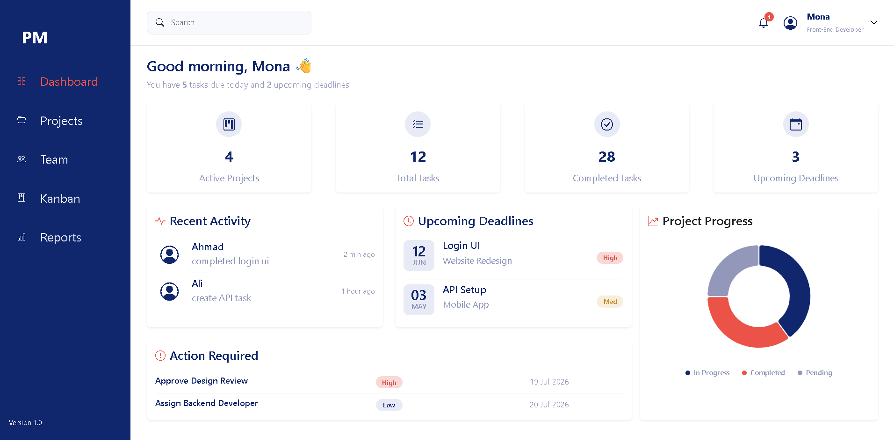
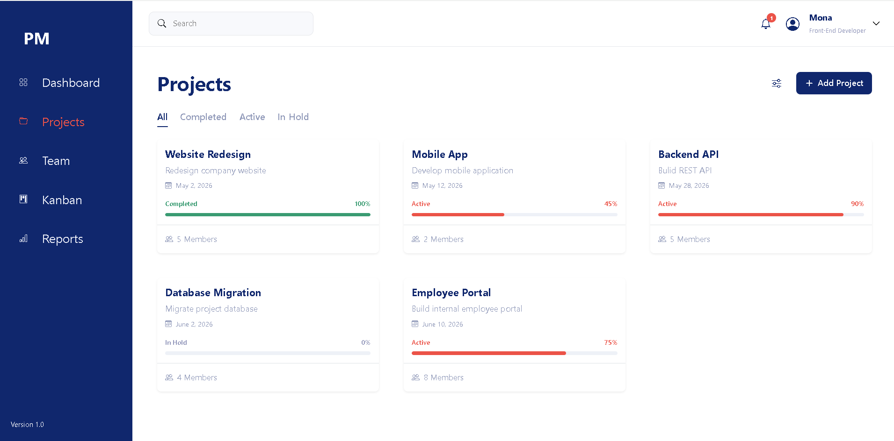
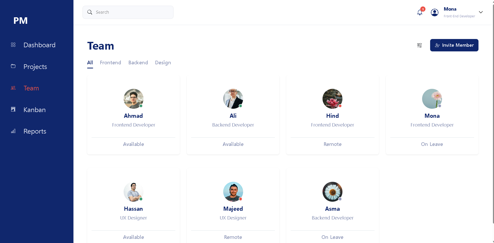
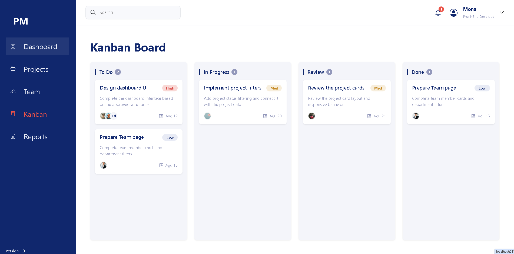
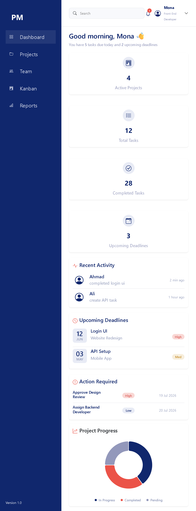
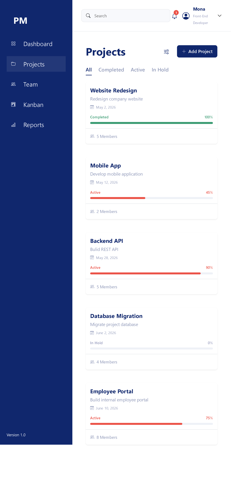
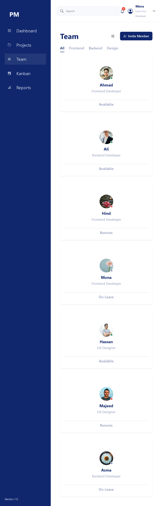
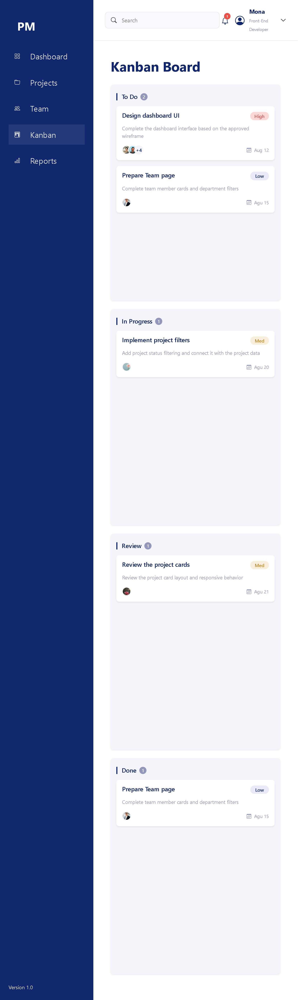

# Project Management Dashboard

Project Management Dashboard is an internal management interface
built for team managers and department leads. It provides a
centralized view of all active projects, team workload, upcoming
deadlines, and required actions — enabling managers to make
informed decisions and keep projects on track.



---

## Key Highlights

- Component-based architecture
- Reusable UI components
- Data-driven components
- Responsive layout
- Consistent design system
- Interactive project progress visualization
- Dynamic filtering with useState
- Drag-and-drop task management
- Dynamic user avatar display
- Designed with future backend integration in mind

---

## Design Workflow

The project follows a structured UI development workflow:

1. Wireframe
2. UI structure and layout planning
3. Component architecture
4. Data structure
5. Reusable components
6. Bootstrap layout
7. Custom CSS styling when required
8. Responsive design
9. Component and page review

---

## Features

### Dashboard

The Dashboard is currently implemented and includes:

- Welcome section
- Statistics section
- Reusable statistics cards
- Recent activity section
- Upcoming deadlines section
- Action Required section
- Reusable Priority component
- Reusable Avatar component
- Project Progress Donut Chart
- Responsive dashboard layout

### Projects

- Projects page with filterable project cards
- Filter by status (All, Active, Completed, In Hold)
- Each card displays name, description, date, status, progress bar, and members
- Dynamic status badge with color indicator
- Responsive card grid layout

### Team

- Team page with filterable members cards
- Filter by department (All, Frontend, Backend, Design)
- Each card displays name, role, avatar, and availability status
- Dynamic availability indicator available, Remote, On Leave
- Responsive card grid layout

### Kanban Board

- Kanban board with four workflow columns
- Drag and drop tasks between columns
- Reorder tasks within columns
- Dynamic task status updates
- Reusable Task Card and Kanban Column components
- User avatar support
- Displays up to two member avatars with remaining member count
- Responsive Kanban layout

---

## Screenshots





---

## Responsive Layout

The interface is designed to be fully responsive across
different screen sizes using Bootstrap's grid system.
| | |
|-----------|-------------|
|| |<br>
| ||

---

## Wireframe

The UI was planned through wireframes before implementation to ensure consistency between the design and the final product.
| | |
|-----------|-------------|
|  |  |<br>
|  |  |

---

## Tech Stack

- React
- JavaScript (ES6)
- Bootstrap 5
- Bootstrap Icons
- Nivo
- @dnd-kit/react
- @dnd-kit/helpers
- Vite
- Git & GitHub

---

## Project Structure

The project structure is currently under development and will be documented in detail after the main pages and reusable components are completed.

> Under development.

---

## Getting Started

### Prerequisites

Make sure you have Node.js and npm installed.

### Installation

Clone the repository:

```bash
git clone https://github.com/Mona96M/Project-Management-System.git
```

Navigate to the project directory:

```bash
cd project-management-system
```

Install dependencies:

```bash
npm install
```

Start the development server:

```bash
npm run dev
```

Open the application in your browser:

http://localhost:5173/
